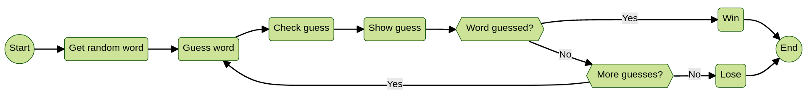

# HW04 - Starting Fresh with Contracts and Tests

In this homework, we’ll be starting on a new project: we’re going to build a
[wordle game][wordle-game] in [C][intro-c]!
Well, before we build the game logic and the interface (the command line), we’re
going to need to start by writing tests (with [pseudocode][pseudocode]) and
contracts around the functions and setup we think the game will need.

### What are the basic tenets of wordle?

* **Five-Letter Word**: The target word is always five letters long.
* **Limited Attempts**: Players have a set number of attempts (usually six) to guess the correct word.
* **Feedback on Guesses**: After each guess, the player receives feedback on each letter:
  - The correct letter is in the correct position.
  - The correct letter is in the wrong position.
  - Incorrect letter.
* **Word List**: The game typically uses a predetermined word list, and players
  try to guess the target word based on their knowledge and the feedback provided.
* **No Time Limit**: There's no time pressure in the game; players can take their
  time to strategize and make educated guesses.
* **Logical Deduction**: Success in Wordle involves logical deduction based on
  feedback from previous guesses, helping players refine their subsequent attempts.

## Learning goals
-  Learn how to design a “somewhat” larger program before directly jumping into the code.
-  Gain a better understanding of what the testing structure will look like before
   writing the core logic of the program(s).

## Tasks
You will be asked to perform the following series of tasks:

1. *Create your homework-4 repository*, with the [GitHub classroom invite][invite]
   and clone that repository locally. You’ll continue to use this repository for
   the next homework as well.

2. *Diagram the structure of your implementation*. We’ll talk more about this
   formally in the upcoming weeks, but you should draw out the steps/flow of
   your implementation and how they connect. For example, it may look something
   like this:

   

   You can commit an image, pdf, etc to your repository for review.

3. **Write out a set of functions with input/output types and require/ensure
   contracts that capture the basic gist of the game**. Some of these could include:

    * Finding a word in a given word list and randomly selecting it for the game.
    * Check for the “word” in the word list set for that game every time a player guesses.
    * Validating the input given by the user (on a command line version, for example),
      e.g. is it five letters, does it consist of actual alphabetical characters, etc.
    * How closely does the input word match the chosen word for the game and how to hint
      to the user that they’re getting closer?
    * Evaluating guesses, which also depends on (and tracks) how many guesses a player has left.
    * Checking if the game is over and the player has exhausted their guesses.
    * *What else?*

    **You should cover the above cases and any others that will be helpful for the
    design of your implementation**. Be creative! These will become super
    important for the next homework.

    [This tutorial][py-wordle] (in Python) may help think through how you’d implement Wordle.

    **Note**: You won’t be expected to come up with a word list. So, design
    everything knowing that it will be given to you upfront! Also, we've provided
    a `wordle-pseudocode.txt` in the template repository, but feel free to use
    a different format/file if you want to, e.g. markdown, code, etc.

4. *Open a Pull Request (PR)* and **do not merge it**.

    For this assignment, you should check out your branch off of the main branch,
    and push up this branch consisting of commit(s). Once this is all ready,
    [please open a Pull Request][gh-pr] to the main branch and leave it there!

5. **Challenge**: Turn your pseudocode tests into real tests (in C0 for now)!
   Just make sure it compiles! You're getting an early start to *HW5*!

We expect that you’ll be using the [C0 VSCode Extension][c0-vscode] to help
to write your C0 programs.

## Step-by-step Example
Here’s a version of the game we built with a command-line “front-end”. Some of
this is open to interpretation, but on wrong answers, I’ve encoded:

* **Lowercase letters** to mean the word consists of this letter, but in a different location.
* **Uppercase letters** to mean the letter is in the right place.
* **Periods** to mean the word does not contain this letter.

Here's an example game:

```sh
----------------------------------------------------
abcdefghijklmnopqrstuvwxyz
Enter your guess #1:
money
----------------------------------------------------

[1] money => .o...
abcd.fghijkl..Opqrstuvwx.z
Enter your guess #2:
notaw
----------------------------------------------------

[1] money => .o...
[2] notaw => .ota.
Abcd.fghijkl..OpqrsTuv.x.z
Enter your guess #3:
rusty
----------------------------------------------------

[1] money => .o...
[2] notaw => .ota.
[3] rusty => ...t.
Abcd.fghijkl..Opq..T.v.x.z
Enter your guess #4:
groan
----------------------------------------------------

[1] money => .o...
[2] notaw => .ota.
[3] rusty => ...t.
[4] groan => ..Oa.
Abcd.f.hijkl..Opq..T.v.x.z
Enter your guess #5:
funny
----------------------------------------------------

[1] money => .o...
[2] notaw => .ota.
[3] rusty => ...t.
[4] groan => ..Oa.
[5] funny => f....
Abcd.F.hijkl..Opq..T.v.x.z
Enter your guess #6:
rummy

YOU LOSE! The word was: afoot
```

## Resources
1. [https://c0.cs.cmu.edu/docs/c0-reference.pdf][c0-ref]
2. [https://jamiemorgenstern.com/teaching/su-122/lectures/01-contracts.pdf][contracts]
3. [https://realpython.com/python-wordle-clone/][py-wordle]
4. [https://www.cs.cmu.edu/~15122/handouts/lectures/21-cnum.pdf][types-c]

## Deadlines and Deliverables
**Due Date**: Monday, November 18, 2024 at 11:59 pm.

**Deliverable**: For this assignment, you have one deliverable.
1) You will either upload your GitHub repository URL to Canvas under
[assignment 4][canvas-4] (embedded via [Gradescope][gradescope] as a PDF, with
just your andrewID and link it) or DM staff over [Slack][slack].

## Assignment Review
Because this is a new class, we are asking you to fill out a short survey to
help us calibrate the homework.  This survey is ungraded, but your input will be
very valuable for us in improving the course both for this semester and for
future years. [Fill out a short survey to help us improve the course!][survey]

## Grading
The total assignment is worth 100 points, but you can receive an extra 10 points
by doing the *Challenge* question.

| Item        | Points    |
| ----------- | ----------- |
| Diagram the structure of your implementation | 10 |
| Add functions with input params and output types | 30 |
| Add actionable contracts for your functions | 30  |
| Add actionable pseudocode test suite | 30   |
| **Challenge**: Add actual tests | +10 |
| Total       | 110  |


[c0-ref]: https://c0.cs.cmu.edu/docs/c0-reference.pdf
[c0-vscode]: https://marketplace.visualstudio.com/items?itemName=15122staff.c0-lsp
[canvas-4]: https://canvas.cmu.edu/courses/43977/assignments/769468
[contracts]: https://jamiemorgenstern.com/teaching/su-122/lectures/01-contracts.pdf
[gh-pr]: https://docs.github.com/en/pull-requests/collaborating-with-pull-requests/proposing-changes-to-your-work-with-pull-requests/creating-a-pull-request
[gradescope]: https://www.gradescope.com/courses/898389/assignments/5302024/
[intro-c]: https://www.cs.cmu.edu/~15122/handouts/lectures/19-cintro.pdf
[invite]: https://classroom.github.com/a/IpUAVigY
[pseudocode]: https://en.wikipedia.org/wiki/Pseudocode
[py-wordle]: https://realpython.com/python-wordle-clone/
[slack]: https://cmu-07-120.slack.com/archives/C0629E4EBJ5
[survey]: https://forms.gle/fuVse4LrpHKQYNcW8
[types-c]: https://www.cs.cmu.edu/~15122/handouts/lectures/21-cnum.pdf
[wordle-game]: https://www.nytimes.com/games/wordle/index.html
